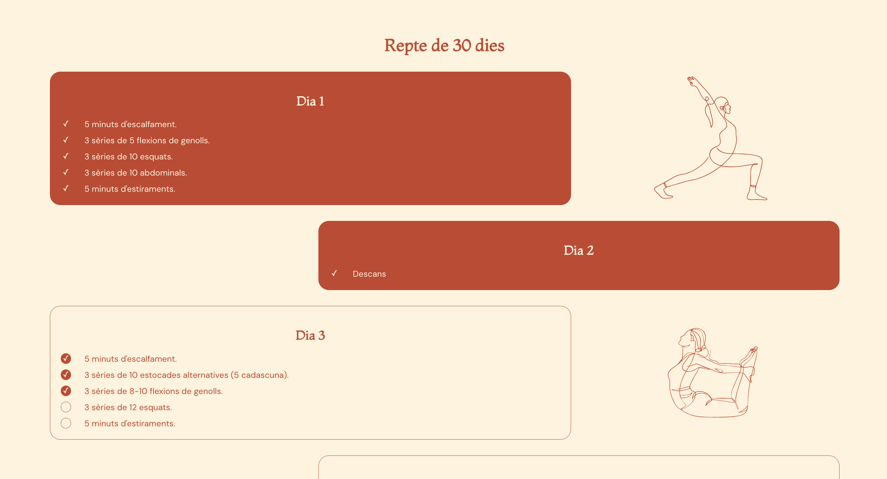

# 30 Day Challenge Tracker

A simple React web application to track your 30-day fitness challenge progress. This app allows you to mark completed tasks for each day of the challenge.



## Features

- Track your daily tasks for a 30-day challenge.
- Mark tasks as completed.
- Store progress in local storage.
- Responsive design for various screen sizes.

## Getting Started

### Prerequisites

- Node.js and npm (Node Package Manager) should be installed on your machine.

### Installation

1. Clone the repository:
   ```
   git clone https://github.com/ainanicolau/30-day-challenge-tracker.git
   ```

2. Navigate to the project directory:
   ```
   cd 30-day-challenge-tracker
   ```

3. Install dependencies:
   ```
   npm install
   ```

## Usage

1. Run the development server:
	```
	npm start
	```

2. Open your web browser and go to http://localhost:3000 to view the app.

3. Follow the on-screen instructions to track your 30-day challenge progress.

